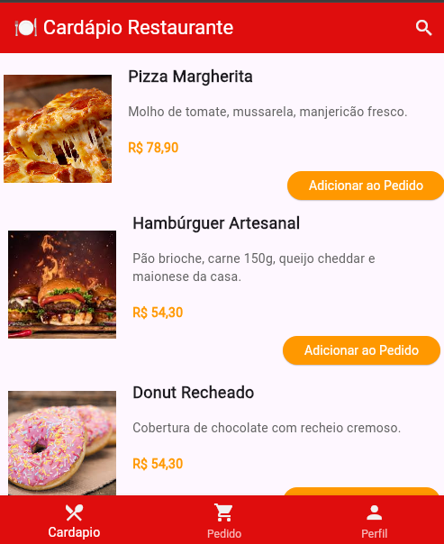

# Atividade Desafio: Criar layout de página de restaurante com Flutter

## Objetivo
Criar um novo projeto Flutter e desenvolver a página inicial de um aplicativo de restaurante **usando exclusivamente widgets de `Column` e `Row`** para a organização dos elementos na tela.

## Instruções
- Utilize apenas `Column` e `Row` para montar o layout (não usar `ListView`, `GridView`, `Flex`, etc.).
- Crie uma estrutura parecida com a imagem de referência fornecida.
- Utilize imagens, textos e botões conforme o exemplo.

## A página deve conter:
- **AppBar** com:
  - Ícone do restaurante
  - Nome "Cardápio Restaurante"
  - Ícone de pesquisa

- **Lista de produtos** (cada produto organizado com `Row` e `Column`):
  - Imagem do produto
  - Nome do prato (em destaque)
  - Descrição do prato (texto menor)
  - Preço em destaque
  - Botão "Adicionar ao Pedido" (à direita)

- **BottomNavigationBar** com três opções:
  - Cardápio
  - Pedido
  - Perfil

## Observações

- O layout não deve ser adaptável, nesse momento, a diferentes tamanhos de tela. Iremos estudar o `SingleChildScrollView`após o termino do projeto.
- Capriche nas cores e estilos para deixar o app bonito e agradável.
- Atenção à organização dos elementos dentro das linhas e colunas!

## Tela

