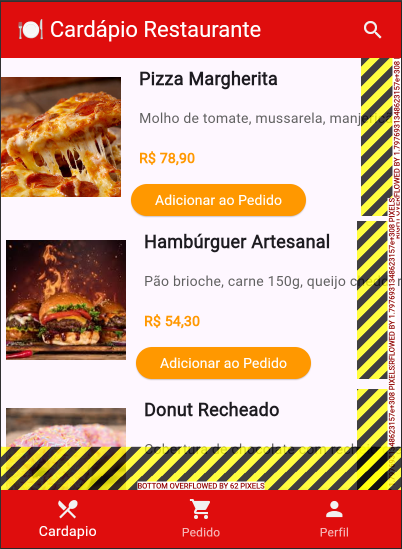

# Projeto Cardápio

Este projeto demonstra como criar uma lista de itens de cardápio utilizando apenas os widgets `Row` e `Column` no Flutter. A interface é simples e organizada, com imagens, descrições e botões para cada item.

## Estrutura do Código

### 1. **Widget Principal**

O widget principal é o `CardapioApp`, que configura o tema e define a página inicial como `CardapioPage`.

```dart
void main() {
  runApp(const CardapioApp());
}

class CardapioApp extends StatelessWidget {
  const CardapioApp({super.key});

  @override
  Widget build(BuildContext context) {
    return MaterialApp(
      debugShowCheckedModeBanner: false,
      title: 'Cardápio Restaurante',
      theme: ThemeData(primarySwatch: Colors.blue),
      home: const CardapioPage(),
    );
  }
}
````

### 2. **Página do Cardápio**

A página do cardápio (`CardapioPage`) utiliza:

- **AppBar**: Exibe o título do restaurante.
- **Body**: Contém uma `Column` principal que organiza os itens do cardápio verticalmente.
- **BottomNavigationBar**: Navegação inferior com ícones para "Cardápio", "Pedido" e "Perfil".

### 3. **Itens do Cardápio**

Cada item do cardápio é representado por um `Row`, que contém:

- Uma imagem do prato (`Image.network`).
- Uma `Column` com:
  - Nome do prato.
  - Descrição.
  - Preço.
  - Botão "Adicionar ao Pedido".

### 4. **Estilização**

Os botões são estilizados com `ElevatedButton.styleFrom`, permitindo personalizar cores, bordas e tamanhos.

## Como Adicionar Mais Itens

Para adicionar mais itens ao cardápio, basta repetir o padrão de `Row` e `Column` dentro da `Column` principal no corpo da página.

Exemplo de um item do cardápio:

```dart
Row(
  children: [
    Image.network(
      "URL_DA_IMAGEM",
      width: 120,
      height: 120,
      fit: BoxFit.cover,
    ),
    SizedBox(width: 10),
    Column(
      crossAxisAlignment: CrossAxisAlignment.start,
      children: [
        Text(
          "Nome do Prato",
          style: TextStyle(
            fontSize: 18,
            fontWeight: FontWeight.bold,
          ),
        ),
        Text(
          "Descrição do prato.",
          style: TextStyle(color: Colors.grey[700]),
        ),
        Text(
          "R\$ 00,00",
          style: TextStyle(
            color: Colors.orange,
            fontWeight: FontWeight.bold,
          ),
        ),
        ElevatedButton(
          onPressed: () {},
          style: ElevatedButton.styleFrom(
            backgroundColor: Colors.orange,
            foregroundColor: Colors.white,
          ),
          child: Text('Adicionar ao Pedido'),
        ),
      ],
    ),
  ],
),
````

## Captura de Tela

Adicione aqui uma captura de tela do aplicativo para ilustrar o resultado final.



## Erro Overflow

### O que é o Erro Overflow?

O erro **Overflow** ocorre no Flutter quando o conteúdo de um widget excede o espaço disponível na tela ou no widget pai. Isso geralmente acontece em layouts que não são responsivos ou quando widgets não têm restrições adequadas de tamanho.

No caso deste projeto, o erro pode ocorrer se:

- O texto ou os widgets dentro de um `Row` ou `Column` ocuparem mais espaço do que o disponível.
- A tela não for rolável e o conteúdo ultrapassar os limites verticais ou horizontais.

### Como Resolver o Erro Overflow?

#### 1. **Adicionar Scroll**

Se o conteúdo for maior que o espaço disponível, envolva o widget principal com um `SingleChildScrollView` para permitir a rolagem.

Exemplo:

```dart
body: SingleChildScrollView(
  child: Column(
    children: [
      // Conteúdo do cardápio
    ],
  ),
),
````

#### 2. Usar Expanded ou Flexible

Se o erro ocorrer dentro de um Row ou Column, use os widgets Expanded ou Flexible para ajustar automaticamente o tamanho dos widgets filhos.

Exemplo:

````dart
Row(
  children: [
    Expanded(
      child: Text(
        "Texto muito longo que pode causar overflow",
        style: TextStyle(fontSize: 16),
      ),
    ),
  ],
),
````

#### 3. Definir Tamanhos Máximos

Defina tamanhos máximos para widgets como Text ou Image para evitar que eles ocupem mais espaço do que o necessário.

Exemplo:

````dart
Image.network(
  "URL_DA_IMAGEM",
  width: 120,
  height: 120,
  fit: BoxFit.cover,
),
````

#### 4. Quebrar Linhas de Texto

Se o texto for muito longo, use a propriedade softWrap ou overflow no widget Text para quebrar ou truncar o texto.

````dart
Text(
  "Texto muito longo que pode causar overflow",
  overflow: TextOverflow.ellipsis, // Adiciona "..." no final do texto
  maxLines: 2, // Limita o texto a 2 linhas
),
````

#### 5. Prevenção de Overflow

Sempre teste o layout em diferentes tamanhos de tela.
Use widgets como Flexible, Expanded e SingleChildScrollView para criar layouts responsivos.

Limite o tamanho de imagens e textos para evitar que ocupem mais espaço do que o necessário.
