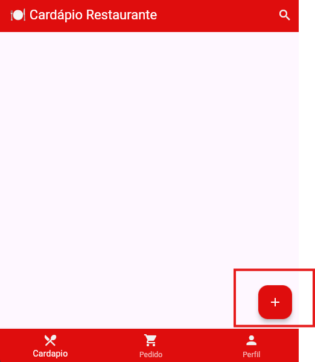
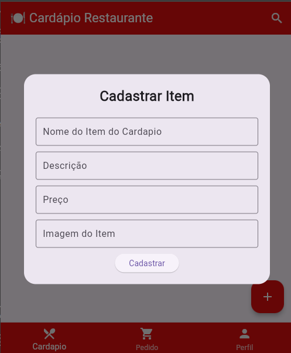

# Criando um Modal

Exemplo criando um modal simples em flutter

## O que é um Modal?

Um modal é uma janela sobreposta à interface principal, usada para exibir informações ou solicitar ações do usuário.

## Passos para criar um Modal

1. **Importe o pacote necessário:**

    ```dart
    import 'package:flutter/material.dart';
    ```

2. **Função para exibir o modal:**

    ```dart
    void mostrarModal(BuildContext context) {
      showDialog(
         context: context,
         builder: (BuildContext context) {
            return AlertDialog(
              title: Text('Título do Modal'),
              content: Text('Conteúdo do modal aqui.'),
              actions: [
                 TextButton(
                    child: Text('Fechar'),
                    onPressed: () {
                      Navigator.of(context).pop();
                    },
                 ),
              ],
            );
         },
      );
    }
    ```

3. **Chame a função ao clicar em um botão:**

* Crie um botão flutuante para chamar o modal

    ```dart
   floatingActionButton: FloatingActionButton(
        onPressed: () {
          // Ação do botão flutuante
          //
        },
    )    
    ```

    

## Personalização

Você pode personalizar o conteúdo, título e ações do modal conforme a necessidade do seu projeto.


No nosso projeto faremos um modal com um formulário de cadastro.

## Como Utilizar o TextField

O `TextField` é um widget do Flutter utilizado para entrada de texto pelo usuário, como em formulários de cadastro.

### Exemplo de uso básico

```dart
TextField(
    decoration: InputDecoration(
        labelText: 'Digite seu nome',
        border: OutlineInputBorder(),
    ),
)
```

### Utilizando em um modal

Você pode adicionar um `TextField` dentro do conteúdo do seu modal para capturar informações do usuário:

```dart
void mostrarModal(BuildContext context) {
    TextEditingController _controller = TextEditingController();

    showDialog(
        context: context,
        builder: (BuildContext context) {
            return AlertDialog(
                title: Text('Cadastro'),
                content: TextField(
                    controller: _controller,
                    decoration: InputDecoration(
                        labelText: 'Nome',
                        border: OutlineInputBorder(),
                    ),
                ),
                actions: [
                    TextButton(
                        child: Text('Salvar'),
                        onPressed: () {
                            // Acesse o texto digitado com _controller.text
                            Navigator.of(context).pop();
                        },
                    ),
                    TextButton(
                        child: Text('Cancelar'),
                        onPressed: () {
                            Navigator.of(context).pop();
                        },
                    ),
                ],
            );
        },
    );
}
```

### Dicas

- Use um `TextEditingController` para acessar o texto digitado.
- Personalize o `InputDecoration` para melhorar a experiência do usuário.
- Lembre-se de validar os dados antes de salvar.

## Exemplo utilizado na tela

````dart
TextField(
                    decoration: const InputDecoration(
                    labelText: 'Nome do Item do Cardapio',
                    border: OutlineInputBorder(),
                  ),
                ),
                const SizedBox(height: 10),
                TextField(
                  
                  decoration: const InputDecoration(
                    labelText: 'Descrição',
                    border: OutlineInputBorder(),
                  ),
                ),
                const SizedBox(height: 10),
                TextField(
                  
                  decoration: const InputDecoration(
                    labelText: 'Preço',
                    border: OutlineInputBorder(),
                  ),
                ),
                const SizedBox(height: 10),
                TextField(
                  
                  decoration: const InputDecoration(
                    labelText: 'Imagem do Item',
                    border: OutlineInputBorder(),
                  ),
                ),
                const SizedBox(height: 10),
                ElevatedButton(
                  onPressed: () {
                    // Ação do botão
                    Navigator.of(context).pop();
                  },
                  child: const Text('Cadastrar'),
                )
````