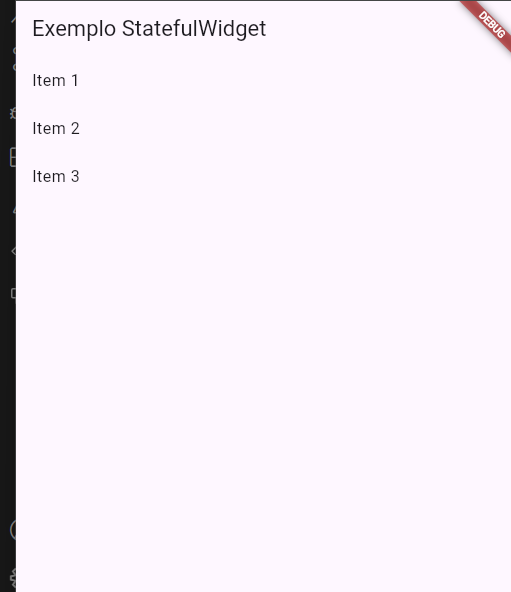

# StatefulWidget no Flutter

O `StatefulWidget` é um dos principais tipos de widgets no Flutter. Ele permite criar interfaces que podem mudar ao longo do tempo, ou seja, widgets que possuem estado mutável.

## Diferença entre StatelessWidget e StatefulWidget

- **StatelessWidget**: Não armazena estado. Seu conteúdo é imutável após a construção.
- **StatefulWidget**: Possui um objeto de estado associado, permitindo que o widget seja reconstruído quando o estado muda.

## Estrutura Básica

Um `StatefulWidget` é composto por duas classes:

1. A classe que estende `StatefulWidget`.

2. A classe de estado que estende `State<T>`.

````dart
class MyWidget extends StatefulWidget {
  const MyWidget({super.key});

  @override
  State<MyWidget> createState() => _MyWidgetState();
}

class _MyWidgetState extends State<MyWidget> {
  @override
  Widget build(BuildContext context) {
    return const Placeholder();
  }
}
````

## Explicação

No exemplo acima:

- `MyWidget` estende `StatefulWidget`, indicando que é um widget com estado mutável. Isso significa que ele pode mudar ao longo do tempo, como quando o usuário interage com a interface, e a tela precisa ser atualizada.

- O const MyWidget({super.key}); é o construtor, que pode receber uma key para identificação.

- O método `createState` retorna uma instância da classe de estado que é `_MyWidgetState`, onde o estado e a lógica do widget são definidos.

- A classe `_MyWidgetState` estende `State<MyWidget>` e implementa o método `build`, responsável por construir a interface do widget.
- O widget retorna um `Placeholder`, que é um widget visual usado para marcar onde o conteúdo real será inserido futuramente.

Essa estrutura permite que você adicione variáveis de estado e métodos dentro de `_MyWidgetState`, tornando possível atualizar a interface do usuário em resposta a interações ou mudanças de dados.

## Exemplo Compelto

````dart
// exemplo.statefulWidget.dart
import 'package:flutter/material.dart';

void main() {
  runApp(const MyApp());
}

class MyApp extends StatelessWidget {
  const MyApp({super.key});

  @override
  Widget build(BuildContext context) {
    return MaterialApp(
      home: Scaffold(
        appBar: AppBar(title: const Text('Exemplo StatefulWidget')),
        body: const Center(child: MyWidget()),
      ),
    );
  }
}

class MyWidget extends StatefulWidget {
  const MyWidget({super.key});

  @override
  State<MyWidget> createState() => _MyWidgetState();
  List<String> get items => ['Item 1', 'Item 2', 'Item 3'];
}

class _MyWidgetState extends State<MyWidget> {
  @override
  Widget build(BuildContext context) {
    return ListView.builder(
      itemCount: widget.items.length,
      itemBuilder: (context, index) {
        return ListTile(title: Text(widget.items[index]));
      },
    );
  }
}

````



## Exemplo **CadastrarItem**

````dart
class CadastrarItem extends StatefulWidget {
  const CadastrarItem({super.key});

  @override
  State<CadastrarItem> createState() => _CadastrarItemState();
}
````

## Explicação da Classe `CadastrarItem`

A classe `CadastrarItem` é um exemplo de `StatefulWidget` no Flutter, utilizada para cadastrar itens em um cardápio. Ela permite adicionar novos itens dinamicamente, atualizando a interface sempre que um novo item é inserido.

### Estrutura

- **CadastrarItem**: É o widget principal, responsável por criar o estado associado.
- **_CadastrarItemState**: Classe de estado onde ficam as variáveis e métodos que controlam o comportamento do widget.

### Variáveis

- `_itemCardapio`: Lista de mapas que armazena os itens do cardápio. Cada item é representado por um mapa com as chaves `'nome'`, `'descricao'`, `'preco'` e `'imagem'`.

### Método `addItemCardapio`

Este método recebe os dados de um novo item (nome, descrição, preço e imagem) e adiciona à lista `_itemCardapio`. O uso do `setState` garante que a interface seja atualizada automaticamente após a adição.

```dart
void addItemCardapio(
    String nomeItem,
    String descricaoItem,
    String precoItem,
    String imagemItem,
) {
    setState(() {
        _itemCardapio.add({
            'nome': nomeItem,
            'descricao': descricaoItem,
            'preco': precoItem,
            'imagem': imagemItem,
        });
    });
}
```

### Resumo

- Permite adicionar itens ao cardápio de forma dinâmica.
- Utiliza o `setState` para atualizar a interface sempre que um novo item é cadastrado.

- Exemplo prático de como gerenciar estado em um `StatefulWidget` no Flutter.
