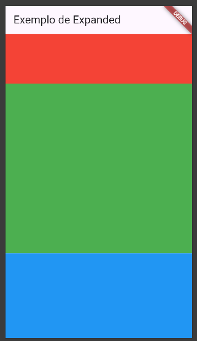

# Widget Expanded

O widget `Expanded` é um componente do Flutter que facilita o gerenciamento do espaço disponível em layouts flexíveis, como `Row`, `Column` ou `Flex`. Ele é utilizado para expandir um widget filho e preencher o espaço restante no eixo principal.

## Como Funciona

O `Expanded` envolve um widget filho e instrui o layout pai a atribuir a ele o máximo de espaço possível no eixo principal. É comum utilizá-lo junto com outros widgets `Expanded` ou widgets com tamanhos fixos.

### Propriedades Principais

- **child**: O widget filho que será expandido.
- **flex**: Um número inteiro opcional que define a proporção de espaço que o widget ocupará em relação a outros widgets `Expanded`.

### Exemplo de Uso

```dart
import 'package:flutter/material.dart';

void main() {
    runApp(MyApp());
}

class MyApp extends StatelessWidget {
    @override
    Widget build(BuildContext context) {
        return MaterialApp(
            home: Scaffold(
                appBar: AppBar(title: Text('Exemplo de Expanded')),
                body: Column(
                    children: [
                        Container(
                            height: 100,
                            color: Colors.red,
                        ),
                        Expanded(
                            flex: 2,
                            child: Container(
                                color: Colors.green,
                            ),
                        ),
                        Expanded(
                            flex: 1,
                            child: Container(
                                color: Colors.blue,
                            ),
                        ),
                    ],
                ),
            ),
        );
    }
}
```

### Explicação do Exemplo

1. O `Container` vermelho possui uma altura fixa de 100 pixels.
2. O primeiro `Expanded` (verde) ocupa 2 partes do espaço restante.
3. O segundo `Expanded` (azul) ocupa 1 parte do espaço restante.

O parâmetro `flex` permite ajustar a proporção de espaço ocupado por cada widget `Expanded`.



## Quando Usar

Utilize o `Expanded` quando precisar distribuir widgets proporcionalmente em um layout flexível, garantindo que eles se ajustem ao espaço disponível.

### Exemplo Real de Uso

Imagine um aplicativo de lista de tarefas onde você deseja que o cabeçalho ocupe um espaço fixo e a lista de tarefas preencha o restante da tela. O `Expanded` pode ser usado para alcançar esse comportamento:

```dart
import 'package:flutter/material.dart';

void main() {
    runApp(TaskApp());
}

class TaskApp extends StatelessWidget {
    @override
    Widget build(BuildContext context) {
        return MaterialApp(
            home: Scaffold(
                appBar: AppBar(title: Text('Lista de Tarefas')),
                body: Column(
                    children: [
                        Container(
                            padding: EdgeInsets.all(16),
                            color: Colors.blueAccent,
                            child: Text(
                                'Minhas Tarefas',
                                style: TextStyle(
                                    color: Colors.white,
                                    fontSize: 24,
                                    fontWeight: FontWeight.bold,
                                ),
                            ),
                        ),
                        Expanded(
                            child: ListView.builder(
                                itemCount: 10,
                                itemBuilder: (context, index) {
                                    return ListTile(
                                        leading: Icon(Icons.check_circle_outline),
                                        title: Text('Tarefa ${index + 1}'),
                                    );
                                },
                            ),
                        ),
                    ],
                ),
            ),
        );
    }
}
```
### Explicação do Exemplo

1. O cabeçalho é um `Container` com um texto fixo e um fundo colorido.
2. O `Expanded` envolve o `ListView.builder`, permitindo que ele preencha o espaço restante na tela.
3. O `ListView.builder` cria uma lista de tarefas dinâmica, que pode ser rolada.

Esse exemplo demonstra como o `Expanded` é útil para criar layouts responsivos e bem organizados.
