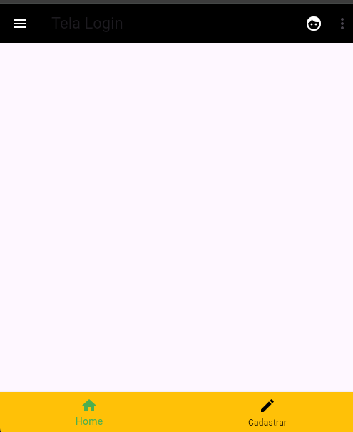

# Trabalhando com AppBar e BottomNavigationBar

Este é um projeto Flutter simples de exemplo, criado para demonstrar uma estrutura básica de aplicação com elementos de interface como `AppBar`, `BottomNavigationBar`, e interações com menus e botões.

## Funcionalidades

- **Tela de Login**: O aplicativo apresenta uma tela principal com um título, ícones no `AppBar`, e um menu suspenso com opções de "Cadastrar" e "Contato".
- **Navegação**: O `BottomNavigationBar` permite a navegação entre as seções de "Home" e "Cadastrar".
- **Menu de Ações**: A `AppBar` contém ícones de ação, como um ícone de perfil e um menu suspenso.

## Tecnologias Usadas

- **Flutter**: Framework para desenvolvimento de aplicativos móveis.
- **Dart**: Linguagem utilizada para o desenvolvimento do aplicativo.

## Exemplo da Tela criada

